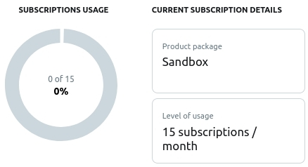

# twit-webhook
Simple Twitter webhook to manage multiple Twitter developer accounts using
[twitivity](https://github.com/twitivity/twitivity).

## Installation

```bash
git clone https://github.com/fakhrirofi/twit-webhook.git
cd twit-webhook
python3 -m venv venv
. venv/bin/activate # linux
# venv\Scripts\activate # windows
pip3 install -r requirements.txt
```

## Set up the environment

Rename `.env.example` to `.env`, then edit the contents.

- You can get the `ENV_NAME` by creating Account Activity API (AAPI) dev
environment at https://developer.twitter.com/en/account/environments.

- There are two options to port forwarding using ngrok:
    * command line

        ```bash
        ngrok http 8080
        ```
    * using pyngrok

        ```python
        from pyngrok import ngrok
        http = ngrok.connect(8080, bind_tls=True)
        url = http.public_url
        print(url)
        ```
    Copy the url (https) to the `URL` at .env file. Don't close the ngrok process.

## Play time!

### Run the webhook

Serve flask app by using syntax:
```bash
flask run --port 8080
```

### Register webhook to twitter

```python
from twitivity import Activity
import os

reg = Activity(os.environ['CONSUMER_KEY'], os.environ['CONSUMER_SECRET'],
               os.environ['ACCESS_TOKEN'], os.environ['ACCESS_TOKEN_SECRET'],
               os.environ['ENV_NAME'])
# because we use ngrok (dynamic url) to run the webhook, we should delete all
# webhooks before registering a new webhook url
reg.delete_all()
reg.register_webhook(f"{os.environ['URL']}/callback/{os.environ['ACCESS_TOKEN'].split('-')[0]}")
```

- `os.environ['ACCESS_TOKEN'].split('-')[0]` is the user id of the
developer account

- The reason there is `callback` on the last line is because the
`callback_route` argument on `Event` class object (at app.py) is `callback`. For
more detail look at [Event class](#event-class)

### Add subscription to the webhook

```python
reg.subscribe()
```

Send any DM to the account, the json data from twitter will be printed on the
terminal screen. Yeay!

### Why `register` and `subscribe` are different?

If you look at [subcriptions dashboard](https://developer.twitter.com/en/account/subscriptions),
you will see this graph.



One AAPI dev environment can only be used to register one webhook. The owner 
(with access token) of Twitter Dev App who can only register the webhook.
> Look at [Register webhook](#register-webhook-twitter), there is 
`reg.delete_all()`. The purpose is to delete all of the previous webhook. So
we can register a new webhook.

One (free) AAPI dev environment can be used to subscribe up to 15 developer
account. To do that, look at [Multiple subcriptions](#multiple-subcriptions).

### Multiple subcriptions

look at [Auth](#auth) to generate ACCESS TOKEN with the same CONSUMER KEY.
```python
user1 = Activity('CONSUMER_KEY', 'CONSUMER_SECRET', 'ACCESS_TOKEN_1',
                 'ACCESS_TOKEN_SECRET_1', 'ENV_NAME')
user1.subscribe()
user2 = Activity('CONSUMER_KEY', 'CONSUMER_SECRET', 'ACCESS_TOKEN_2',
                 'ACCESS_TOKEN_SECRET_2', 'ENV_NAME')
user2.subscribe()
```

## Auth

### Generate TOKEN using OAuth

```python
from tools import OAuth
auth = OAuth('CONSUMER_KEY', 'CONSUMER_SECRET')
url = auth.get_url()
print(url)
# open the url, authorize, and copy the PIN
token = auth.get_token('PIN')
print(token)
```

### Generate TOKEN using XAuth
```python
from tools import get_xauth_access_token
token = get_xauth_access_token('XAUTH_CONSUMER_KEY', 'XAUTH_CONSUMER_SECRET',
                               'TWITTER_USERNAME', 'TWITTER_PASSWORD')
print(token)
```

### (Un)Official Consumer Key
Reference: https://gist.github.com/shobotch/5160017
```
# Twitter for iPhone (XAuth)
Consumer key:    IQKbtAYlXLripLGPWd0HUA
Consumer secret: GgDYlkSvaPxGxC4X8liwpUoqKwwr3lCADbz8A7ADU

# Twitter for iPad (XAuth)
Consumer key:    CjulERsDeqhhjSme66ECg
Consumer secret: IQWdVyqFxghAtURHGeGiWAsmCAGmdW3WmbEx6Hck

# Twitter for Mac (OAuth)
Consumer key:    3rJOl1ODzm9yZy63FACdg
Consumer secret: 5jPoQ5kQvMJFDYRNE8bQ4rHuds4xJqhvgNJM4awaE8
```
**Account that using (Un)Official Consumer Key can't be used to `subscribe` webhook**

## Customize app.py to manage multiple developer accounts

You can add many functions that have one parameter (json data type) to process
data sent from twitter.

Data reference: https://developer.twitter.com/en/docs/twitter-api/enterprise/account-activity-api/guides/account-activity-data-objects

### `webhook` variable

list of dictionary that contains `user_id`, `consumer_secret` and `function`.
```python
[{
    'user_id': 'USER_ID',
    'consumer_secret': 'CONSUMER_SECRET',
    'function': 'Callable',
}]
```

- `USER_ID` can be `'ACCESS_TOKEN'.split('-')[0]`. The user id of
the account is actually mentioned on the `ACCESS_TOKEN`.

- `consumer_secret` is optional (can be `None`) but the key must be exists on
the dictionary. It's required when the owner of `user_id` is the owner of
Twitter Dev App.

- `function` is a Callable that will be called when webhook receives data. It
has one parameter and the type is json. 

### `Event` class

**`Event(callback_route, webhook)`**

- `callback_route` is the route that will be receive data from twitter. Not
like flask app route, it doesn't need slash '/'. Example: `callback`

- `webhook` is [webhook variable](#webhook-variable)

#### `get_wsgi` method

This method has no argument and returns flask WSGI app

## Automation example

Copy or move automation.py from example to the root folder.
```bash
cp example/automation.py automation.py # copy
# mv example/automation.py automation.py # move
```
Run automation.py by using syntax:
```bash
python3 automation.py
```
